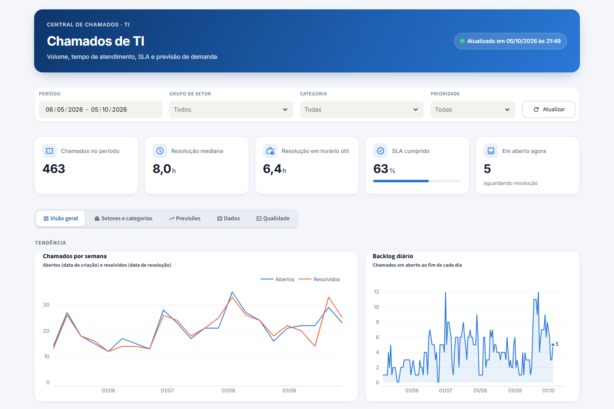
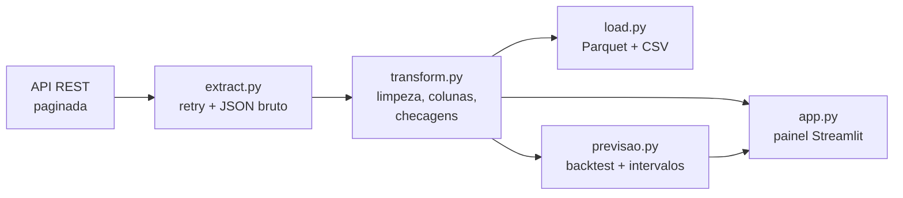
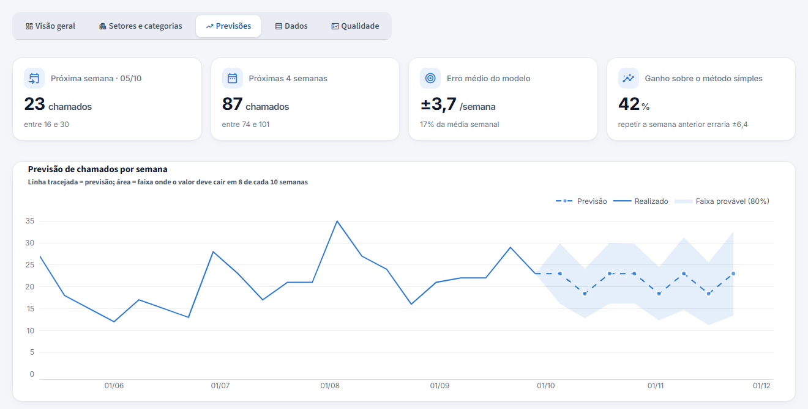

# Painel de chamados de TI

Pipeline de dados em Python que extrai os chamados de suporte de TI de uma API REST, corrige os
problemas de qualidade dos dados, gera tabelas prontas para BI e publica um painel interativo com
**previsão de demanda semanal**.



## Destaques

- **Pipeline ETL modular**: extração paginada com retry, transformação em modelo estrela e carga em Parquet e CSV.
- **Qualidade de dados tratada na origem do cálculo**: o SLA foi recalculado porque o campo da API vinha sempre "ok"; datas de fechamento em lote, fuso UTC e texto livre também foram tratados.
- **Tempo em horário útil**: cálculo próprio que desconta fins de semana, feriados e horas fora do expediente.
- **Previsão escolhida por evidência**: 10 modelos comparados por backtest com origem móvel. O vencedor erra **42% menos** que o baseline ingênuo.
- **Painel em Streamlit** com dados ao vivo (cache de 1 hora), filtros, comparação com o período anterior e exportação em CSV.

## Arquitetura



| Etapa | O que faz |
|---|---|
| **Extração** | Percorre todas as páginas da API, com até 3 tentativas e backoff exponencial. Guarda o JSON bruto com data e hora, para auditoria e reprocessamento offline. |
| **Transformação** | Converte datas de UTC para o horário de Brasília, cria 46 colunas na tabela fato (tempos, SLA, faixas, dia, hora, turno), padroniza categorias e agrupa 54 setores em 11 grupos. |
| **Carga** | Tabela fato, dimensões (setor, categoria, unidade) e agregados (diário, semanal, mensal, por setor, mapa de calor) em Parquet e em CSV no padrão brasileiro (`;` e vírgula decimal). |
| **Painel** | Indicadores, tendência semanal, backlog, evolução mensal, mapa de calor dia × hora, rankings, previsão e tabela de qualidade. |

As regras de negócio (metas de SLA, expediente, feriados, mapeamentos) ficam em [`src/config.py`](src/config.py), separadas do código.

## Qualidade de dados

A maior parte do trabalho foi garantir que os números fossem confiáveis. Nenhum registro é apagado: cada problema é corrigido no cálculo ou sinalizado numa tabela de qualidade.

| Problema encontrado | Tratamento |
|---|---|
| Status de SLA sempre "ok" | SLA recalculado a partir dos timestamps de abertura e resolução |
| Datas de fechamento em lote (229 chamados fechados em poucos instantes) | Tempos medidos pelo timestamp de **resolução** |
| Primeira resposta registrada em só ~20% dos chamados | Indicador exibido com aviso de cobertura |
| Local digitado em texto livre (191 grafias para 54 locais) | Análise pela dimensão cadastrada (setor) |
| Categoria misturada com tipo de chamado | Categorias padronizadas e tipos separados |
| Grafia que muda na API (ex.: "Tonner" → "Toner") | Mapeamento cobre as duas formas |
| Datas em UTC | Conversão para `America/Sao_Paulo` |

## Previsão de demanda



Com cerca de 20 semanas de histórico, ARIMA ou Prophet seriam instáveis. A abordagem foi:

1. **Série semanal só com semanas completas** (a primeira e a atual, se parciais, ficam de fora).
2. **Candidatos simples**: médias móveis de 4 e 8 semanas, suavização exponencial (α de 0,1 a 0,5) e Holt com tendência amortecida.
3. **Backtest com origem móvel**: cada modelo prevê de 1 a 4 semanas à frente a partir de cada ponto do passado; vence o de menor MAE.
4. **Intervalo de 80%** calculado a partir dos resíduos do próprio backtest, alargando com o horizonte.
5. **Ajuste por feriados**: semanas com menos dias úteis recebem previsão proporcional.

Resultado atual: MAE de **3,7 chamados por semana**, contra 6,4 de repetir a semana anterior.

## Stack

Python 3.13 · pandas · NumPy · requests · PyArrow · Plotly · Streamlit · python-dotenv

## Estrutura

```
├── app.py              # painel Streamlit
├── main.py             # pipeline que grava as tabelas em data/final/
├── src/
│   ├── config.py       # regras de negócio
│   ├── extract.py      # extração paginada da API
│   ├── transform.py    # limpeza, colunas, agregados e checagens de qualidade
│   ├── load.py         # gravação em Parquet e CSV
│   ├── previsao.py     # modelos, backtest e intervalos
│   ├── graficos.py     # gráficos Plotly padronizados
│   └── estilo.py       # visual do painel (CSS e componentes)
└── docs/               # imagens do README
```

## Como rodar

```bash
pip install -r requirements.txt
cp .env.example .env      # preencha API_URL e API_KEY
streamlit run app.py      # painel em http://localhost:8501
python main.py            # gera as tabelas em data/final/
python main.py --offline  # reprocessa o último JSON salvo, sem chamar a API
```

## Deploy

Publicado no Streamlit Community Cloud. A chave da API fica em **Settings → Secrets** do app, nunca no repositório:

```toml
API_KEY = "..."
```

Cada `git push` na branch `main` atualiza o painel publicado.
